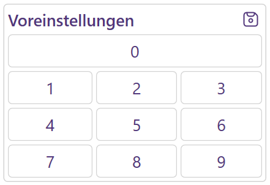
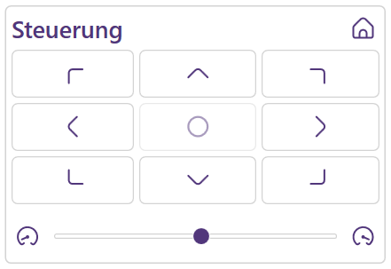
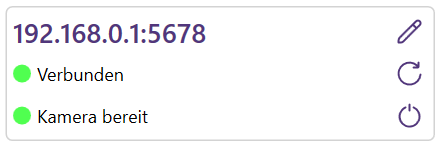

# 

ViscaCamLink ist eine Kamerasteuerung für [PTZ-Kameras](https://de.m.wikipedia.org/wiki/PTZ-Kamera), die über eine Netzwerkverbindung mit dem VISCA Protokoll ansprechbar sind.

## Funktionen

### Voreinstellungen

* Speichern und laden von bis zu zehn Positionen (inklusive Zoom) als Voreinstellung
* Globale Tastenbelegung (Hotkeys) für jede Voreinstellung (derzeit festgelegt auf die Numpad-Tasten 0-9)

 

### Steuerung

* Freies Bewegen in jede Richtung (per Schalter)
* 18-stufige Anpassung der Bewegungsgeschwindigkeit
* Zurücksetzen in Ausgangsposition

 

### Zoom

* Freies herein- und herauszoomen
* 7-stufige Anpassung der Zoom-Geschwindigkeit

 

### Weitere

* Benutzerspezifische Speicherung des Oberflächen-Layouts
* Oberfläche verfügbar in Deutsch und Englisch
* Volle Unterstützung der Windows-Skalierung

## Installation

### Windows-Installer

Die Setup-Datei (.msi) ausführen (z. B. durch einen Doppelklick oder das Kontextmenü) und dem Assistenten folgen. Danach das Programm starten (optional automatisch oder manuell über das Windows-Startmenü) und mit [Erster Start](#erster-start) fortfahren.

### Portabel

Die im Archiv (.zip) enthaltene Ausführungsdatei (.exe) an einen beliebigen Ort entpacken, an dem der auszuführende Benutzer Berechtigungen hat. Danach starten (z. B. durch einen Doppelklick oder das Kontextmenü) und mit [Erster Start](#erster-start) fortfahren.

## Erster Start

Da für die Anwendung .NET 6 benötigt wird, kommt, wenn dies noch nicht vorinstalliert ist, nun eine Aufforderung dazu. Dieser einfach folgen und ggf. die Anwendung erneut starten ([Manuelle Installation - .NET Desktop Runtime](https://dotnet.microsoft.com/en-us/download/dotnet/6.0)). 

Danach ist ViscaCamLink bereit für die Benutzung.

## Benutzung 

Nach dem ersten Start muss die IP-Adresse der Kamera und der Port für das VISCA Protokoll (wenn vom Standard abweichend) hinterlegt werden. (Wie Sie an diese Informationen herankommen, beschreibt das Benutzerhandbuch der Kamera)

Danach kann die Verbindung über den entsprechenden Schalter in der Adresszeile aufgebaut werden. Ob dies erfolgreich war, zeigt die Status-Anzeige darunter. Ebenfalls wird angezeigt, ob die Kamera angeschaltet ist oder sich im Standby-Modus befindet.

 

## Roadmap 

* Anpassbare Tastenbelegung
* Anpassbare Bezeichnung von Voreinstellungen
* Weitere Voreinstellungen

## Lizenz

[Apache 2.0](https://www.viscacamlink.info/en/license)

Diese Applikation basiert auf dem Demo-Quelltext "CameraControl" und nutzt Teile des Projektes "AutoUpdater.NET". Für weitere Informationen siehe [Hinweise zu Drittanbieter-Software](THIRD-PARTY-NOTICES).

Icons von flaticon.com/de/uicons
