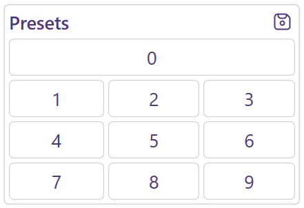
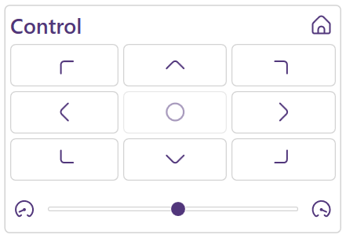
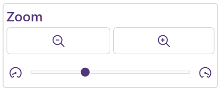
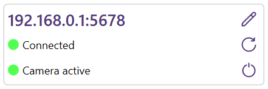

# 

ViscaCamLink is a camera controller for [PTZ cameras](https://en.wikipedia.org/wiki/Pan%E2%80%93tilt%E2%80%93zoom_camera) that can be reached via a network connection using the VISCA protocol.

🇩🇪 | 🇦🇹 | 🇨🇭 – [In Deutsch lesen](README-de.md)

## Features

### Presets

* Save and load up to ten positions (including zoom) as presets
* Global hotkey for each preset (currently assigned to the numpad keys 0-9)

     
    

### Control

* Free movement in any direction (via button)
* 18-step adjustment of movement speed
* Reset to initial position

     
    

### Zoom

* Freely zooming in and out
* 7-step adjustment of zoom speed

     
    

### More

* User-specific saving of layout settings
* Interface available in english and german
* Full Windows scaling support

## Installation

### Windows installer

Execute the setup file (.msi) (e.g. by double-clicking or using the context menu) and follow the wizard. Then start the program (automatically if selected or manually via the Windows start menu) and continue with [First start](#first-start).

### Portable

Unpack the execution file (.exe) contained in the archive (.zip) to any location where the executing user has permissions. Then start it (e.g. by double-clicking or using the context menu) and proceed with [First start](#first-start).

## First start

Since .NET 6 is required for the application, a prompt will appear if this is not yet pre-installed. Simply follow this prompt and restart the application if necessary ([Manual installation - .NET Desktop Runtime](https://dotnet.microsoft.com/en-us/download/dotnet/6.0)).

After that ViscaCamLink is ready for use.

## Usage 

After the first start, the IP address of the camera and the port for the VISCA protocol (if different from the default) must be typed in. (How to get this information is described in the user manual of the camera)

After that, the connection can be established using the corresponding button in the address bar. Whether this was successful is shown in the status display below. It also shows if the camera is switched on or is in standby mode.

 

## Roadmap 

* Customizable key assignment
* Customizable name of presets
* Additional preset slots

## License

[Apache 2.0](https://www.viscacamlink.info/en/license)

This application is based on the demo code "CameraControl" and uses fragments of the project "AutoUpdater.NET". For further information see the [third party notices](THIRD-PARTY-NOTICES).

Icons from flaticon.com/uicons

